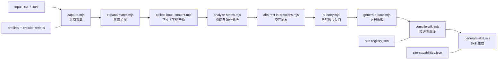
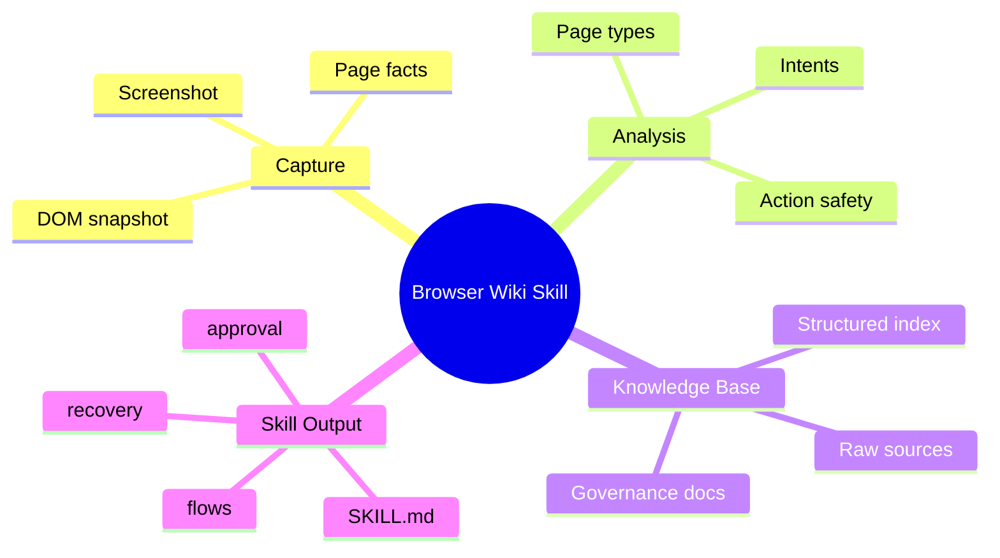

# Browser-Wiki-Skill

<div align="center">

**把站点采集、状态分析、知识库编译与本地 Skill 生成，压成一条可维护、可扩展、可复用的自动化流水线。**

<p>
  
  
  
  
</p>

</div>

---

## Overview

这个仓库的目标不是单点脚本，而是一套站点建模与 Skill 生产系统：

- 从页面采集开始，沉淀结构化状态、意图、文档和知识库
- 用统一的 `site-registry.json` 和 `site-capabilities.json` 维护站点真值
- 最终产出可在 Codex / 本地工作流中复用的仓库内 Skill 源

它适合这类工作：

- 为新站点快速搭建采集与 Skill 生成链路
- 为已有站点补充 crawler、能力模型和自然语言入口
- 把“临时爬虫脚本”升级成“可维护知识资产”

## Visual Pipeline



## What Makes This Repo Different

<table>
  <tr>
    <td width="33%">
      <h3>Site-as-System</h3>
      <p>不是只抓页面，而是把 host、页型、动作、能力、意图和输出统一建模。</p>
    </td>
    <td width="33%">
      <h3>Pipeline-as-Product</h3>
      <p>每一步都有明确输入输出，方便替换、复用、测试和扩展。</p>
    </td>
    <td width="33%">
      <h3>Skill-as-Artifact</h3>
      <p>最终产物不是零散脚本，而是结构化的仓库内 Skill 源与知识库。</p>
    </td>
  </tr>
</table>

## Supported Sites

| Site | Skill | Archetype | Typical Intents | Status |
| --- | --- | --- | --- | --- |
| `www.22biqu.com` | `22biqu` | chapter-content | 下载整本、打开章节、搜索内容 | 已接入 |
| `www.bilibili.com` | `bilibili` | catalog-detail | 打开视频、打开作者、搜索视频 | 已接入 |
| `jable.tv` | `jable` | catalog-detail | 打开视频、打开演员页、榜单查询 | 已接入 |
| `moodyz.com` | `moodyz-works` | catalog-detail | 搜索作品、打开作品、打开演员页 | 已接入 |

## Capability Snapshot



## Quick Start

### 1. 初始化 PowerShell UTF-8 环境

```powershell
. .\scripts\bootstrap.ps1
```

这会统一：

- PowerShell 输入/输出编码
- `PYTHONIOENCODING`
- `PYTHONUTF8`

### 2. 跑完整流水线

```powershell
node .\run-pipeline.mjs https://www.22biqu.com/
```

### 3. 单独生成 Skill

```powershell
node .\generate-skill.mjs https://www.22biqu.com/
node .\generate-skill.mjs https://moodyz.com/works/date --skill-name moodyz-works
```

## Common Commands

### 下载整本小说

```powershell
& 'C:\Users\lyt-p\AppData\Local\Microsoft\WinGet\Packages\PyPy.PyPy.3.11_Microsoft.Winget.Source_8wekyb3d8bbwe\pypy3.11-v7.3.20-win64\pypy3.exe' '.\download_book.py' 'https://www.22biqu.com/' --book-title '玄鉴仙族'
```

### 强制重新抓取

```powershell
& 'C:\Users\lyt-p\AppData\Local\Microsoft\WinGet\Packages\PyPy.PyPy.3.11_Microsoft.Winget.Source_8wekyb3d8bbwe\pypy3.11-v7.3.20-win64\pypy3.exe' '.\download_book.py' 'https://www.22biqu.com/' --book-title '玄鉴仙族' --force-recrawl
```

### 生成或复用站点 crawler

```powershell
node .\generate-crawler-script.mjs https://www.22biqu.com/
```

### 运行测试

```powershell
node --test .\tests\node\*.test.mjs
python -m unittest discover -s .\tests\python -p 'test_*.py'
```

## Core Layout

| Path | Role |
| --- | --- |
| [`profiles/`](./profiles) | 站点级规则源，每个 host 一个 profile |
| [`crawler-scripts/`](./crawler-scripts) | 按 host 缓存 crawler 脚本与元数据 |
| [`knowledge-base/`](./knowledge-base) | 编译后的知识库与 `raw/` 事实归档 |
| [`book-content/`](./book-content) | 下载缓存与正文产物 |
| [`skills/`](./skills) | 仓库内维护的 Skill 源文件 |
| [`schema/`](./schema) | 知识库与文档治理规则 |
| [`tests/`](./tests) | Node / Python 回归测试 |

## Source of Truth

| File | Purpose |
| --- | --- |
| [`site-registry.json`](./site-registry.json) | 记录 host、知识库路径、Skill 路径、crawler 路径和最近一次下载/编译信息 |
| [`site-capabilities.json`](./site-capabilities.json) | 记录 archetype、page types、capability families、supported intents、safe/approval actions |

## Add a New Site

新站点扩展建议沿着这条路径推进：

1. 先补 `profiles/<host>.json` 或站点 archetype 所需配置
2. 生成或复用 crawler：[`generate-crawler-script.mjs`](./generate-crawler-script.mjs)
3. 跑通采集与知识库编译：[`run-pipeline.mjs`](./run-pipeline.mjs)
4. 生成仓库内 Skill：[`generate-skill.mjs`](./generate-skill.mjs)
5. 用 [`NEW_SITE_CHECKLIST.md`](./NEW_SITE_CHECKLIST.md) 回归检查

## Repo Notes

<details>
<summary><strong>运行与产物说明</strong></summary>

- `download_book.py` 是保留的小说下载入口
- `download_bilibili.py` 负责 bilibili 下载相关能力
- `book-content/` 默认按 host 落盘，例如 `book-content/www.22biqu.com/...`
- 运行时优先复用本地完整 artifact；缺失时再复用或生成 crawler
- `skills/` 是仓库内维护源，真正给 Codex 使用的安装目录在 `.codex/skills/`

</details>

<details>
<summary><strong>适合放在 GitHub 首页的阅读顺序</strong></summary>

1. 先看上面的 Pipeline 图，理解整条链路
2. 再看 `Supported Sites`，确认当前能力面
3. 然后从 `Quick Start` 跑一次最短路径
4. 最后再深入 `profiles/`、`knowledge-base/` 和 `skills/`

</details>

---

## Build Skills, Not Just Scripts

这个仓库最终想沉淀的，不是“一次性站点脚本”，而是可以持续演化的站点知识、能力模型和本地 Skill 生产能力。
