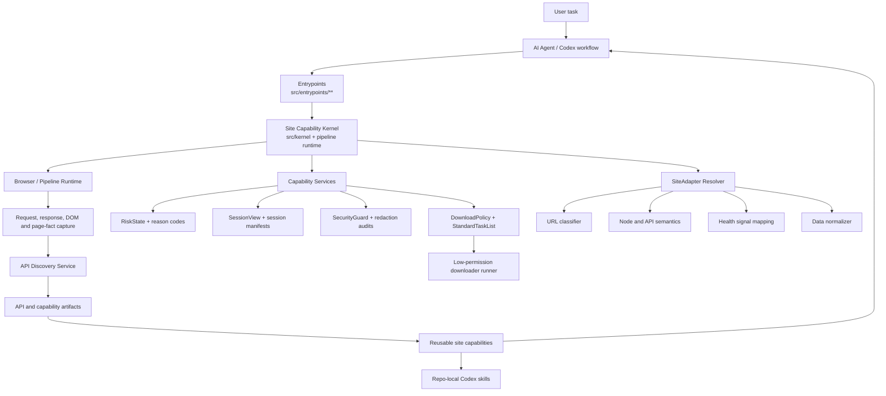
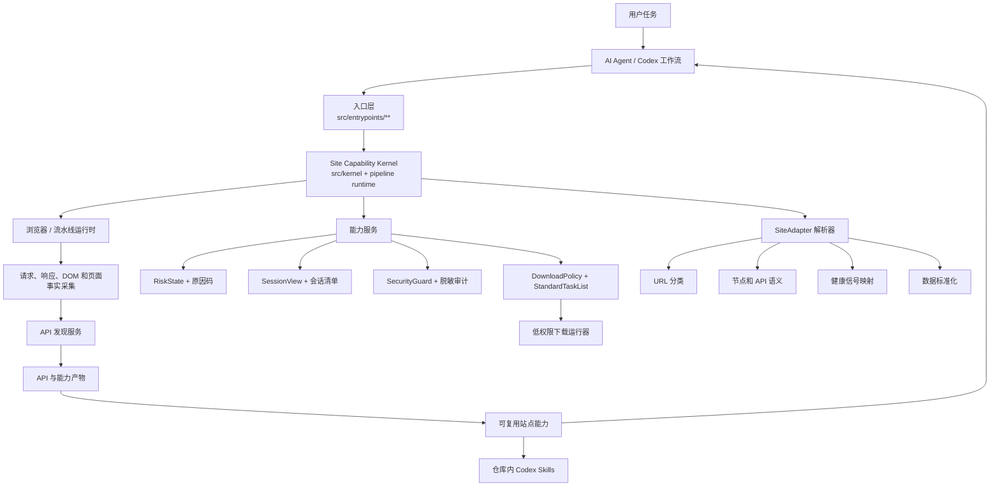

<h1 align="center">SiteForge</h1>

<p align="center">
  A reusable Site Capability Layer for AI agents to understand, adapt to, and automate real websites.
</p>

<p align="center">
  
  
  
  
  
</p>

<p align="center">
  <a href="#english">English</a> |
  <a href="#chinese">中文</a>
</p>

<p align="center">
  GitHub does not run custom JavaScript in README files. This page uses native GitHub collapsible sections for language switching.
  <br>
  GitHub README 不运行自定义 JavaScript。本页使用 GitHub 原生折叠区块实现双语切换。
</p>

<a id="english"></a>

<details open>
<summary><strong>English</strong></summary>

## SiteForge

SiteForge is a reusable Site Capability Layer that helps AI agents understand, adapt to, and automate real websites through structured browser behavior, API discovery, and site-specific capability adapters.

It is not a collection of one-off browser scripts. It is an architecture for turning real website behavior into reusable, governed capabilities: browser capture, API knowledge, session health, risk states, download planning, and repo-local Codex Skills.

### Navigation

<a href="#en-why">Why</a> |
<a href="#en-core-idea">Core Idea</a> |
<a href="#en-features">Features</a> |
<a href="#en-architecture">Architecture</a> |
<a href="#en-quick-start">Quick Start</a> |
<a href="#en-roadmap">Roadmap</a>

<a id="en-why"></a>

## Why

Most browser automation projects are fragile.

They are usually tightly coupled to one website's DOM structure, request pattern, login state, and anti-abuse behavior. Once the website changes, the automation breaks, and the reason is often hidden inside script failure logs.

SiteForge solves this by introducing a reusable **Site Capability Layer**.

It separates:

- generic browser and pipeline orchestration
- reusable capability services
- site-specific adapters
- structured API knowledge
- session and risk state handling
- low-permission downloader execution
- governed artifact storage

So agents can work with websites in a more stable, explainable, and reusable way.

<a id="en-core-idea"></a>

## Core Idea

SiteForge treats each website as a set of discoverable and reusable capabilities.

Instead of hardcoding one-off browser scripts, it builds a layered system that can:

1. capture real browser behavior
2. discover useful network interfaces
3. normalize site-specific data
4. store reusable API and execution knowledge
5. preserve session and risk boundaries
6. expose stable capabilities to agents and skills

The goal is simple: a website should become a documented capability surface that an AI agent can inspect, reason about, and reuse safely.

<a id="en-features"></a>

## Features

### Site Capability Layer

A layered architecture that separates site-agnostic orchestration from site-specific logic. The implementation is tracked in `CONTRIBUTING.md` as a 20-section Site Capability Layer matrix, currently marked `verified`.

### API Discovery

Captures observed browser network requests as candidates, records redacted evidence, and prevents automatic promotion into a verified API catalog. API promotion requires explicit evidence, adapter validation, schema compatibility, and policy gates.

Status: **Done for core infrastructure**, **Experimental for live site-specific evidence freshness**.

### Session View And Session Governance

Represents reusable login state through minimized session manifests and `SessionView` boundaries. Download and social consumers receive only governed session views, not raw cookies, browser profiles, or credential containers.

Status: **In progress**. Core contracts and tests exist; live recovery remains operator-approved and site-specific.

### Risk State And Health Recovery

Normalizes login walls, rate limits, CAPTCHA-like surfaces, profile health risks, platform risk, permission failures, and recovery paths into structured states and reason codes.

Status: **Done for core taxonomy and gates**, **Experimental for live account/session freshness**.

### SiteAdapter

Encapsulates website-specific behavior such as URL classification, node/API interpretation, pagination rules, login-state signals, health-signal mapping, field normalization, and capability mapping.

Status: **Done for registered adapters**, with continued site-specific hardening expected.

### Artifact System

Stores inventories, manifests, API candidates, catalog evidence, lifecycle events, download queues, redaction audits, and skill generation outputs as structured artifacts.

Status: **Done for governed artifact families**.

### Unified Download Runner

Moves downloads behind a low-permission runner with dry-run planning, manifests, queues, resume, retry, and native resource seed support. Legacy fallback remains behind explicit boundaries.

Status: **In progress**. Core runner is implemented; some live native resolver paths remain evidence-dependent.

## Use Cases

SiteForge can be used for:

- building browser-based AI agents
- discovering website data APIs from real user flows
- converting website-specific behavior into reusable adapters
- reusing authenticated browser sessions without persisting raw secrets
- detecting login, permission, CAPTCHA, rate-limit, and profile-health states
- creating structured website capability knowledge
- reducing repeated work when supporting new websites
- producing repo-local Codex skills from governed site knowledge

For end users, this can eventually help agents explain failures, recover from session issues, reuse known workflows, and make automation more auditable.

<a id="en-architecture"></a>

## Architecture



The kernel is intentionally light. It owns orchestration, lifecycle, context, artifact routing, schema governance, and safety boundaries. It does not own site-specific semantics.

Capability services are reusable. They provide discovery, inventory, API candidate handling, redaction, reason semantics, session views, risk state, policy handoff, lifecycle events, and schema compatibility.

SiteAdapters isolate each website. They own URL families, page/API interpretation, pagination, login and restriction signals, field normalization, and capability mapping.

The downloader is a low-permission consumer. It only receives governed tasks, policies, minimal session views, and resolved resources.

### Architecture design (updated)

- `run-pipeline` implements the stage graph and records failure states.
- `generate-skill` consumes run artifacts and composes governed skill outputs.
- The `kernel` coordinates lifecycle and artifact movement; it remains site-agnostic.
- `SiteAdapter` modules own per-site interpretation: URL classification, health signal translation, normalization, and capability mapping.
- `Capability services` own common contracts: discovery, evidence, risk, policy, redaction, and queue/runstate handling.
- `session-view` boundaries enforce privacy and login isolation so downloader and lower layers never receive raw credentials or profile files.
- `LayerConsumerResult` / `CoverageDelta` are now explicit evidence carriers in execution and gate decisions.

## Usage design guide

The recommended workflow is to treat every action as a staged command:

1. Run capture and analysis
```powershell
node .\src\entrypoints\pipeline\run-pipeline.mjs <site-url> --skill-name <site> --progress plain
```

2. Inspect the generated artifact set and review warning states
```powershell
git status
```

3. Generate skill artifacts only from reviewed evidence
```powershell
node .\src\entrypoints\pipeline\generate-skill.mjs <site-url> --skill-name <site> --progress plain
```

4. Apply governance gates and promote only when checks pass
```powershell
node .\src\entrypoints\pipeline\run-pipeline.mjs <site-url> --goal validate --progress plain
```

Failure handling rule:
- Any `blocked`/`retryable` signal is first-class and should be recorded as partial results where applicable.
- `partial` artifacts are valid for diagnosis and planning, but are not auto-promoted into repo-local skills.

## Capability Matrix

| Capability | Common Service | SiteAdapter Required | Status |
| --- | ---: | ---: | --- |
| Request and page capture | Yes | Partial | Done |
| API candidate discovery | Yes | Partial | Done |
| Verified API catalog promotion | Yes | Yes | Experimental |
| Session reuse boundary | Yes | Site validation | In progress |
| Risk and health detection | Yes | Yes | Done |
| URL classification | No | Yes | Done |
| Request signing / site auth quirks | No | Yes | Planned |
| Pagination parsing | Partial | Yes | In progress |
| Data normalization | Partial | Yes | In progress |
| Artifact generation | Yes | No | Done |
| Redaction and secret scanning | Yes | No | Done |
| Unified download planning | Yes | Partial | In progress |
| Native resource resolution | Partial | Yes | Experimental |
| Repo-local skill generation | Yes | Yes | Done |

Status vocabulary:

- **Done**: implemented with focused tests and documented evidence.
- **In progress**: implemented for core paths, still expanding coverage or live evidence.
- **Experimental**: usable in constrained paths, but freshness and site-specific evidence matter.
- **Planned**: intentionally documented as future or site-specific work.

## Concepts

### Site Capability Layer

The architecture boundary that turns website behavior into reusable, governed capability surfaces.

### Site Capability Kernel

The site-agnostic orchestration layer. It coordinates lifecycle, context, schemas, artifacts, and safety boundaries without embedding concrete site rules.

### Capability Services

Shared services for discovery, inventory, API candidates, reason codes, redaction, risk state, session views, policy handoff, artifacts, and lifecycle hooks.

### SiteAdapter

A site-specific adapter for URL classification, semantic interpretation, health signals, pagination, field normalization, and capability mapping.

### SessionProvider / SessionView

This repo currently implements the boundary as session manifests, session runners, and `SessionView`. The public provider abstraction is still evolving, so session reuse is documented as **In progress** rather than a stable public API.

### RiskStateMachine

Implemented as `RiskState`, reason codes, health recovery, and execution gates. It classifies risks such as login walls, rate limits, CAPTCHA-like surfaces, account restrictions, and profile-health failures.

### Artifact System

Structured outputs for inventories, API candidates, catalogs, download manifests, queues, redaction audits, lifecycle events, reports, and skill generation.

### API Discovery

The capture-to-candidate flow that records observed network behavior as redacted evidence. Observed APIs are not automatically promoted to verified capability.

## Supported Sites

The current registry includes 21 site families. Support levels differ by site and capability; many catalog sites are read-only metadata integrations, not download targets.

| Site family | Discovery | Session | Risk detection | Adapter | Status |
| --- | ---: | ---: | ---: | ---: | --- |
| `www.22biqu.com` | Done | Not required | Partial | Done | Done |
| `www.qidian.com` | Done | Site-specific | Partial | Done | Done |
| `www.bz888888888.com` | Done | Not required | Done | Done | Experimental, Cloudflare challenge boundary |
| `www.bilibili.com` | Done | Site-specific | Done | Done | In progress |
| `www.douyin.com` | Done | Site-specific | Done | Done | In progress |
| `www.xiaohongshu.com` | Done | Site-specific | Done | Done | In progress |
| `x.com` | Done | Site-specific | Done | Done | Experimental |
| `www.instagram.com` | Done | Site-specific | Done | Done | Experimental |
| `jable.tv` | Done | Not required | Partial | Done | Done; download placeholder experimental |
| `moodyz.com` | Done | Not required | Partial | Done | Done |
| Official AV catalog sites | Done | Not required | Partial | Done | Done for public metadata |

Official AV catalog sites include `rookie-av.jp`, `madonna-av.com`, `dahlia-av.jp`, `www.sod.co.jp`, `s1s1s1.com`, `attackers.net`, `www.t-powers.co.jp`, `www.8man.jp`, `www.dogma.co.jp`, `www.km-produce.com`, and `www.maxing.jp`.

Jable download routing is an experimental placeholder only. It can produce an auditable `jable-native-resolver-required` manifest through the unified download runner, but it does not parse Jable player pages, raw media URLs, CDN URLs, manifests, sessions, or browser profiles.

<a id="en-quick-start"></a>

## Quick Start

This repository currently has no `package.json`, so there is no `npm install` or `npm run dev` setup. The stable local workflow uses direct Node.js and Python entrypoints.

Clone the repository:

```bash
git clone https://github.com/yuetongli-PL/SiteForge.git
cd SiteForge
```

If you checked out this repo before the recent history cleanup, update your local copy to the rewritten history before running pipelines:

```powershell
git fetch origin
git checkout main
git reset --hard origin/main
```

The recommended local checkout path is `C:\Users\lyt-p\Desktop\SiteForge`. The legacy GitHub URL `https://github.com/yuetongli-PL/Browser-Wiki-Skill.git` and legacy local path `C:\Users\lyt-p\Desktop\Browser-Wiki-Skill` are kept only as redirect / compatibility references. If an active Codex session is still running from the legacy path, close it and rename the directory externally rather than renaming the current working directory in place.

Initialize the local PowerShell environment:

```powershell
. .\tools\bootstrap.ps1
```

Run a full pipeline against a site:

```powershell
node .\src\entrypoints\pipeline\run-pipeline.mjs https://www.22biqu.com/
```

Generate a repo-local skill:

```powershell
node .\src\entrypoints\pipeline\generate-skill.mjs https://www.22biqu.com/
node .\src\entrypoints\pipeline\generate-skill.mjs https://moodyz.com/works/date --skill-name moodyz-works
```

Run focused validation:

```powershell
node --test .\tests\node\site-capability-matrix.test.mjs
node --test .\tests\node\site-adapter-contract.test.mjs .\tests\node\site-onboarding-discovery.test.mjs
node --test .\tests\node\downloads-runner.test.mjs .\tests\node\planner-policy-handoff.test.mjs
node .\tools\prepublish-secret-scan.mjs
git diff --check
```

Run broad local validation before release-sized changes:

```powershell
node --test .\tests\node\*.test.mjs
python -m unittest discover -s .\tests\python -p "test_*.py"
```

## Basic Usage

> The public API is still experimental and may change as the Site Capability Layer evolves.

Use the CLI entrypoints directly:

Primary long-running Node CLI entrypoints now share the same progress feedback
system. Human progress is written to stderr, so stdout stays machine-readable
for JSON callers. Interactive terminals get a restrained live status line;
CI, pipes, redirected output, and `--no-tty` get stable line-by-line text.
Use `--json` to keep only JSON output, `--quiet` to suppress human progress,
`--progress plain` to force copyable logs, and `--force-tty` only when a caller
knows stderr supports ANSI refresh.

`build` now uses a package-manager-style progress view. In an interactive TTY it
renders a compact pipeline panel with overall stage progress, current stage,
elapsed time, pending/running/completed/warning/failed/skipped state, and
width-aware item/path display. In plain mode it emits stable stage lines, then a
human summary with artifacts, quality warnings, and next commands. The default
human mode no longer dumps raw JSON; use `--json` for machine-readable output,
`--verbose` for full paths and stage details, `--debug` for stack traces and raw
diagnostics, `--no-color` to disable ANSI color, `--ascii` to disable Unicode
glyphs, and `--compact` for shorter output.

Unified facade:

```powershell
node .\src\entrypoints\cli.mjs build https://www.22biqu.com/
node .\src\entrypoints\cli.mjs skill https://www.22biqu.com/
node .\src\entrypoints\cli.mjs doctor https://www.22biqu.com/
node .\src\entrypoints\cli.mjs site capability-compile --site qidian --json
node .\src\entrypoints\cli.mjs download plan https://www.bilibili.com/video/BV...
node .\src\entrypoints\cli.mjs download execute https://www.bilibili.com/video/BV... --site bilibili
```

Run site pipeline:

```powershell
node .\src\entrypoints\pipeline\run-pipeline.mjs https://www.22biqu.com/
```

Inspect site onboarding and health surfaces:

```powershell
node .\src\entrypoints\cli.mjs site doctor https://www.22biqu.com/
```

Compile descriptor-only Site Capability Graph and Planner dry-run evidence:

```powershell
node .\src\entrypoints\cli.mjs site capability-compile --site qidian --json
```

Plan downloads through the unified runner:

```powershell
node .\src\entrypoints\cli.mjs download plan https://www.bilibili.com/video/BV... --site bilibili
```

Progress examples:

```text
[build] start status=pending message="生成站点 Skill"
[build] stage=1/10 name=capture status=running message="观察网站结构"
[build] stage=1/10 name=capture status=success message="Captured page facts"
[build] status=success message="Skill generated" skill=skills/example/SKILL.md

[download] start status=pending message="规划下载任务"
[download] stage=1/1 name=plan status=skipped message="Dry run only; no download was attempted"

[doctor] start status=pending message="站点健康诊断"
[doctor] stage=1/7 name=session status=success message=unified-session-runner
[doctor] stage=4/7 name=capture status=success message=success
```

Failures use the same recovery shape everywhere:

```text
[build] status=failed stage=capture reason="verification or access-control page"
[build] safety="系统已安全停止，未尝试绕过 CAPTCHA、MFA、平台风控、限流、权限或访问控制。"
[build] next="node src/entrypoints/cli.mjs site doctor https://example.com --no-headless --reuse-login-state"
```

The progress layer never prints raw cookies, tokens, authorization headers,
session ids, browser profile material, or user data directories. CAPTCHA, MFA,
platform risk, rate limits, permission checks, and access-control pages remain
manual safety boundaries; the CLI reports a safe stop instead of attempting a
bypass.

The same renderer is also wired into session/login recovery commands, social
site action commands, and catalog/list collection commands such as
`site-login.mjs`, `site-keepalive.mjs`, `session.mjs`,
`session-repair-plan.mjs`, `bilibili-action.mjs`, `douyin-action.mjs`,
`xiaohongshu-action.mjs`, `jable-ranking.mjs`,
`jp-av-release-catalog.mjs`, `moodyz-month-catalog.mjs`,
`site-credentials.mjs`, `site-scaffold.mjs`, `bilibili-open-page.mjs`,
`bilibili-extract-links.mjs`, `social-auth-import.mjs`,
`generate-crawler-script.mjs`, `douyin-export-cookies.mjs`,
`x-action.mjs`, `instagram-action.mjs`, `douyin-query-follow.mjs`, and
`douyin-resolve-media.mjs`. The same renderer is available in social operations
helpers including `social-live-verify.mjs`, `social-kb-refresh.mjs`,
`social-live-resume.mjs`, `social-live-report.mjs`, and
`social-live-dashboard.mjs`; operator-facing recovery and planning helpers
`social-auth-recover.mjs`, `social-health-watch.mjs`, and
`social-command-templates.mjs` use the same renderer.

Aggregate public official AV release metadata:

```powershell
node .\src\entrypoints\cli.mjs catalog jp-av-release --start 2026-01-01 --end 2026-05-04
```

BZ888 public-direct script:

```powershell
python .\src\sites\bz888\download\python\bz888.py --book-url https://www.bz888888888.com/52/52885/ --out-dir .\book-content\bz888-direct
```

The BZ888 path reads only public HTML and stops with `blocked-by-cloudflare-challenge` when the site serves a challenge. It does not read cookies, browser profiles, or challenge-derived credentials.

## Design Principles

- **Capability-first, not script-first**<br>
  Websites are modeled as reusable capabilities, not one-off automation scripts.
- **Lightweight kernel, pluggable services**<br>
  The kernel handles orchestration, context, artifacts, schemas, lifecycle, and safety boundaries.
- **Site-specific logic stays isolated**<br>
  Each website keeps its own adapter for URL patterns, semantic interpretation, auth/risk signals, pagination, and normalization.
- **Learn from real browser behavior**<br>
  API knowledge should come from actual observed browser requests, then pass explicit validation before reuse.
- **Explainable automation**<br>
  Failures are represented as structured states and reason codes, not silent script errors.
- **Low-permission execution**<br>
  Downloaders and reports consume governed artifacts, not raw browser state.

<a id="en-roadmap"></a>

## Roadmap

- [x] Define Site Capability Layer architecture
- [x] Add Site Capability Kernel contracts
- [x] Add request and response capture foundations
- [x] Add API candidate discovery and governed catalog artifacts
- [x] Add SiteAdapter contracts and registered adapters
- [x] Add SessionView and trust-boundary tests
- [x] Add RiskState, reason codes, and health recovery gates
- [x] Add artifact redaction and prepublish secret scan
- [x] Add unified download runner foundation
- [x] Add repo-local skill generation paths
- [ ] Stabilize a public JavaScript API surface
- [ ] Expand live API verification evidence per site
- [ ] Continue reducing legacy downloader fallback paths
- [ ] Improve human-visible recovery flow for login, session, and profile-health risks
- [x] Add clearer release/versioning policy

## Repository Layout

| Path | Purpose |
| --- | --- |
| `src/entrypoints/` | CLI and workflow entrypoints. |
| `src/kernel/` | Site-agnostic kernel contracts and readiness checks. |
| `src/pipeline/` | Capture, expand, knowledge-base, and skill pipeline runtime. |
| `src/sites/capability/` | Shared Site Capability Layer services and governed contracts. |
| `src/sites/core/adapters/` | SiteAdapter implementations and resolver. |
| `src/sites/downloads/` | Unified download runner, policies, modules, resource seeds, and recovery. |
| `src/sites/sessions/` | Session manifests, repair commands, release gates, and runner contracts. |
| `config/` | Stable site registry and capability truth. |
| `profiles/` | Repo-safe site capability profiles, not browser profile directories. |
| `skills/` | Repo-local Codex Skill sources. |
| `crawler-scripts/` | Generated crawler scripts and metadata. |
| `tests/` | Node and Python contract, unit, boundary, and integration tests. |
| `tools/` | Release audit, secret scan, reports, and maintenance helpers. |

Long-lived project guidance lives in root files:

- `README.md` for project orientation.
- `CONTRIBUTING.md` for safety gates, Site Capability matrix, and verification batches.
- `AGENTS.md` for Codex execution rules.
- `SECURITY.md` for sensitive-data and automation boundaries.

## Contributing

Start with `CONTRIBUTING.md` and `AGENTS.md`.

Before staging changes:

```powershell
git status --short
node .\tools\prepublish-secret-scan.mjs
git diff --check
```

For Site Capability Layer work, update the implementation matrix in `CONTRIBUTING.md` and run the smallest focused test batch close to the changed behavior.

Do not commit:

- raw credentials, cookies, CSRF values, authorization headers, SESSDATA, tokens, or session ids
- browser profile directories
- `.playwright-mcp/`, `runs/`, `book-content/`, downloaded media, logs, or local runtime artifacts
- CAPTCHA, MFA, anti-bot, access-control, or platform-risk bypass logic

## Release And Versioning

Release readiness is evidence-based, not date-based. A change is release-owned
only when its source, test, config, skill, tool, or root-document edits match the
current batch scope and the worktree has been rechecked immediately before
staging. Local runtime outputs, browser profile material, downloaded media,
logs, generated run artifacts, and unrelated dirty files stay out of release
scope.

Schema and contract versions change only when the persisted or public contract
changes. Additive compatible fields keep the current version and must keep
existing compatibility tests green. Incompatible contract changes require an
explicit version bump, compatibility or migration tests, matrix evidence, and
Agent B acceptance before any status or release claim is promoted.

No tag, package version bump, push, PR, publication, live capability claim, or
live authenticated validation is implied by local tests passing. Release-sized
changes must rerun the broad Node/Python checks, the prepublish secret scan, and
`git diff --check`; live claims additionally need explicit operator approval and
sanitized artifacts.

## Help And Maintenance

Use GitHub issues for project questions, bug reports, and capability requests. Security-sensitive reports should follow `SECURITY.md` and must not include raw secrets, cookies, profile paths, or screenshots containing credentials.

Current maintenance is repository-local and contributor-driven. The canonical source of truth for implementation status is the Site Capability Layer matrix in `CONTRIBUTING.md`.

## License

No `LICENSE` file is currently present in this repository. Until a license is added, do not assume MIT, Apache-2.0, or any other open-source license.

## Source Of Truth

- `CONTRIBUTING.md`: Site Capability Layer matrix, focused regression batches, safety gates, and release checks.
- `config/site-registry.json`: registered site families and implementation paths.
- `config/site-capabilities.json`: stable capability facts by host.
- `schema/profile-schemas.mjs`: checked-in profile validation rules.
- `tools/prepublish-secret-scan.mjs`: repository safety scan before publication.

This README is intentionally short enough to act as a GitHub project homepage. Detailed operational gates live in `CONTRIBUTING.md`.

</details>

<a id="chinese"></a>

<details>
<summary><strong>中文</strong></summary>

## SiteForge

SiteForge 是一套可复用的 Site Capability Layer，帮助 AI Agent 通过结构化浏览器行为、API 发现和站点适配器理解、适配并自动化真实网站。

它不是一次性的浏览器自动化脚本集合，而是一套把真实网站行为沉淀成可治理、可复用能力的架构：浏览器采集、API 知识、会话健康、风险状态、下载规划，以及仓库内 Codex Skills。

### 导航

<a href="#zh-why">为什么需要它</a> |
<a href="#zh-core-idea">核心思想</a> |
<a href="#zh-features">核心能力</a> |
<a href="#zh-architecture">架构</a> |
<a href="#zh-quick-start">快速开始</a> |
<a href="#zh-roadmap">路线图</a>

<a id="zh-why"></a>

## 为什么需要它

大多数浏览器自动化项目都很脆弱。

它们通常强绑定某个网站的 DOM 结构、请求模式、登录态和风控行为。一旦网站变化，自动化就会失效，而且失败原因往往只隐藏在脚本日志中。

SiteForge 用一套可复用的 **Site Capability Layer** 解决这个问题。

它把下面这些职责拆开：

- 通用浏览器和流水线编排
- 可复用能力服务
- 站点专属适配器
- 结构化 API 知识
- 会话与风险状态处理
- 低权限下载执行
- 可治理的产物存储

最终目标是让 Agent 以更稳定、可解释、可复用的方式处理真实网站。

<a id="zh-core-idea"></a>

## 核心思想

SiteForge 把每个网站视为一组可以被发现、理解和复用的能力，而不是一堆 DOM 选择器。

它不硬编码一次性脚本，而是构建一套分层系统，用来：

1. 采集真实浏览器行为
2. 发现可复用网络接口
3. 标准化站点专属数据
4. 存储可复用 API 和执行知识
5. 保留会话和风险边界
6. 向 Agent 和 Skill 暴露稳定能力

目标很直接：让网站成为一套有文档、有边界、可审计的能力面，而不是难维护的临时脚本。

<a id="zh-features"></a>

## 核心能力

### Site Capability Layer

一套分层架构，把站点无关的编排逻辑和站点专属语义拆开。当前实现由 `CONTRIBUTING.md` 中的 20 节 Site Capability Layer matrix 跟踪，状态为 `verified`。

### API 发现

把浏览器观察到的网络请求记录为候选 API，写入脱敏证据，并阻止它们自动升级为已验证 API。API 升级必须经过显式证据、适配器验证、schema 兼容和策略门禁。

状态：**核心基础设施 Done**，**实时站点证据新鲜度 Experimental**。

### 会话视图与会话治理

通过最小化 session manifest 和 `SessionView` 边界表示可复用登录态。下载器和社交任务只能接收受治理的会话视图，不能接触原始 cookies、浏览器 profile 或凭证容器。

状态：**In progress**。核心契约和测试已存在；实时恢复仍需要操作者批准，并且是站点专属行为。

### 风险状态与健康恢复

把登录墙、限流、类 CAPTCHA 页面、profile 健康风险、平台风险、权限失败和恢复路径标准化为结构化状态和 reason codes。

状态：**核心分类和门禁 Done**，**实时账号/会话新鲜度 Experimental**。

### SiteAdapter

封装站点专属行为，包括 URL 分类、节点/API 解释、分页规则、登录态信号、健康信号映射、字段标准化和能力映射。

状态：**已注册适配器 Done**，后续仍需要按站点继续加固。

### 产物系统

把 inventories、manifests、API candidates、catalog evidence、lifecycle events、download queues、redaction audits 和 skill generation outputs 存成结构化产物。

状态：**受治理产物族 Done**。

### 统一下载运行器

把下载行为放到低权限 runner 后面，支持 dry-run planning、manifest、queue、resume、retry 和 native resource seeds。Legacy fallback 仍受显式边界约束。

状态：**In progress**。核心 runner 已实现；部分实时 native resolver 路径仍依赖证据。

## 使用场景

SiteForge 适合用于：

- 构建基于浏览器的 AI Agent
- 从真实用户流程中发现网站数据 API
- 把站点专属逻辑转成可复用适配器
- 在不持久化原始敏感材料的前提下复用登录态
- 检测登录、权限、CAPTCHA、限流和 profile 健康状态
- 创建结构化网站能力知识
- 降低新增站点支持的重复成本
- 从受治理的站点知识生成仓库内 Codex Skills

对于最终用户，它的长期价值是让 Agent 能解释失败原因、从会话问题中恢复、复用已知工作流，并让自动化过程更可审计。

<a id="zh-architecture"></a>

## 架构



Kernel 保持轻量，只负责编排、生命周期、上下文、产物路由、schema 治理和安全边界，不承载具体站点语义。

Capability Services 是可复用机制层，提供 discovery、inventory、API candidate handling、redaction、reason semantics、session views、risk state、policy handoff、lifecycle events 和 schema compatibility。

SiteAdapters 隔离每个网站的差异，负责 URL 家族、页面/API 解释、分页、登录和限制信号、字段标准化以及能力映射。

Downloader 是低权限消费者，只接收受治理的任务、策略、最小化会话视图和已解析资源。

## 能力矩阵

| 能力 | 通用服务 | 需要适配器 | 状态 |
| --- | ---: | ---: | --- |
| 请求与页面采集 | Yes | Partial | Done |
| API 候选发现 | Yes | Partial | Done |
| 已验证 API 目录升级 | Yes | Yes | Experimental |
| 会话复用边界 | Yes | Site validation | In progress |
| 风险与健康检测 | Yes | Yes | Done |
| URL 分类 | No | Yes | Done |
| 请求签名 / 站点认证细节 | No | Yes | Planned |
| 分页解析 | Partial | Yes | In progress |
| 数据标准化 | Partial | Yes | In progress |
| 产物生成 | Yes | No | Done |
| 脱敏与敏感信息扫描 | Yes | No | Done |
| 统一下载规划 | Yes | Partial | In progress |
| 原生资源解析 | Partial | Yes | Experimental |
| 仓库内 Skill 生成 | Yes | Yes | Done |

状态说明：

- **Done**：已实现，并有聚焦测试和文档证据。
- **In progress**：核心路径已实现，仍在扩展覆盖或实时证据。
- **Experimental**：可在受限路径使用，但依赖新鲜证据和站点情况。
- **Planned**：计划中，或保留给站点专属实现。

## 核心概念

### Site Capability Layer

把网站行为转化为可复用、可治理能力面的架构边界。

### Site Capability Kernel

站点无关的编排层，负责生命周期、上下文、schemas、artifacts 和安全边界，不嵌入具体站点规则。

### Capability Services

跨站复用服务，包括 discovery、inventory、API candidates、reason codes、redaction、risk state、session views、policy handoff、artifacts 和 lifecycle hooks。

### SiteAdapter

站点专属适配器，负责 URL 分类、语义解释、健康信号、分页、字段标准化和能力映射。

### SessionProvider / SessionView

当前仓库用 session manifests、session runners 和 `SessionView` 实现会话边界。公共 provider 抽象仍在演进，因此会话复用标记为 **In progress**，不是稳定公共 API。

### RiskStateMachine

当前通过 `RiskState`、reason codes、health recovery 和 execution gates 实现，用于分类登录墙、限流、类 CAPTCHA 页面、账号限制和 profile 健康失败。

### Artifact System

用于 inventories、API candidates、catalogs、download manifests、queues、redaction audits、lifecycle events、reports 和 skill generation 的结构化输出系统。

### API Discovery

把观察到的网络行为从 capture 转成候选 API，并写入脱敏证据。观察到的 API 不会自动升级成已验证能力。

## 支持站点

当前 registry 包含 21 个站点家族。不同站点和能力的支持程度不同；许多 catalog 站点是只读元数据集成，不是下载目标。

| 站点家族 | 发现 | 会话 | 风险检测 | 适配器 | 状态 |
| --- | ---: | ---: | ---: | ---: | --- |
| `www.22biqu.com` | Done | Not required | Partial | Done | Done |
| `www.qidian.com` | Done | Site-specific | Partial | Done | Done |
| `www.bz888888888.com` | Done | Not required | Done | Done | Experimental, Cloudflare challenge boundary |
| `www.bilibili.com` | Done | Site-specific | Done | Done | In progress |
| `www.douyin.com` | Done | Site-specific | Done | Done | In progress |
| `www.xiaohongshu.com` | Done | Site-specific | Done | Done | In progress |
| `x.com` | Done | Site-specific | Done | Done | Experimental |
| `www.instagram.com` | Done | Site-specific | Done | Done | Experimental |
| `jable.tv` | Done | Not required | Partial | Done | Done; download placeholder experimental |
| `moodyz.com` | Done | Not required | Partial | Done | Done |
| 官方 AV catalog 站点 | Done | Not required | Partial | Done | Done for public metadata |

官方 AV catalog 站点包括 `rookie-av.jp`、`madonna-av.com`、`dahlia-av.jp`、`www.sod.co.jp`、`s1s1s1.com`、`attackers.net`、`www.t-powers.co.jp`、`www.8man.jp`、`www.dogma.co.jp`、`www.km-produce.com` 和 `www.maxing.jp`。

Jable 下载路由只是实验占位。它可以通过统一下载 runner 产出可审计的 `jable-native-resolver-required` manifest，但不会解析 Jable 播放器页面、原始媒体 URL、CDN URL、manifest、session 或浏览器 profile。

<a id="zh-quick-start"></a>

## 快速开始

当前仓库没有 `package.json`，因此没有 `npm install` 或 `npm run dev`。稳定的本地工作流使用直接的 Node.js 和 Python 入口。

克隆仓库：

```bash
git clone https://github.com/yuetongli-PL/SiteForge.git
cd SiteForge
```

推荐本地检出路径是 `C:\Users\lyt-p\Desktop\SiteForge`。旧 GitHub URL `https://github.com/yuetongli-PL/Browser-Wiki-Skill.git` 和旧本地路径 `C:\Users\lyt-p\Desktop\Browser-Wiki-Skill` 只作为 redirect / 兼容说明保留。如果当前 Codex 会话仍从旧路径运行，请先关闭会话，再从外部重命名目录，不要在活动 cwd 内直接改名。

初始化本地 PowerShell 环境：

```powershell
. .\tools\bootstrap.ps1
```

对站点运行完整流水线：

```powershell
node .\src\entrypoints\pipeline\run-pipeline.mjs https://www.22biqu.com/
```

生成仓库内 Skill：

```powershell
node .\src\entrypoints\pipeline\generate-skill.mjs https://www.22biqu.com/
node .\src\entrypoints\pipeline\generate-skill.mjs https://moodyz.com/works/date --skill-name moodyz-works
```

运行聚焦验证：

```powershell
node --test .\tests\node\site-capability-matrix.test.mjs
node --test .\tests\node\site-adapter-contract.test.mjs .\tests\node\site-onboarding-discovery.test.mjs
node --test .\tests\node\downloads-runner.test.mjs .\tests\node\planner-policy-handoff.test.mjs
node .\tools\prepublish-secret-scan.mjs
git diff --check
```

发布级改动前运行广义验证：

```powershell
node --test .\tests\node\*.test.mjs
python -m unittest discover -s .\tests\python -p "test_*.py"
```

## 基础用法

> 公共 API 仍处于实验阶段，会随着 Site Capability Layer 演进而变化。

直接使用 CLI 入口：

运行站点流水线：

```powershell
node .\src\entrypoints\pipeline\run-pipeline.mjs https://www.22biqu.com/
```

检查站点接入与健康状态：

```powershell
node .\src\entrypoints\cli.mjs site doctor https://www.22biqu.com/
```

通过统一 runner 规划下载：

```powershell
node .\src\entrypoints\cli.mjs download plan https://www.bilibili.com/video/BV...
```

聚合公开官方 AV 发行元数据：

```powershell
node .\src\entrypoints\cli.mjs catalog jp-av-release --start 2026-01-01 --end 2026-05-04
```

BZ888 公开直连脚本：

```powershell
python .\src\sites\bz888\download\python\bz888.py --book-url https://www.bz888888888.com/52/52885/ --out-dir .\book-content\bz888-direct
```

BZ888 路径只读取公开 HTML；如果站点返回 challenge，会以 `blocked-by-cloudflare-challenge` 停止。它不读取 cookies、browser profiles 或 challenge-derived credentials。

## 设计原则

- **能力优先，而不是脚本优先**<br>
  网站被建模为可复用能力，而不是一次性自动化脚本。
- **轻量 Kernel，可插拔服务**<br>
  Kernel 只处理编排、上下文、产物、schemas、生命周期和安全边界。
- **站点专属逻辑保持隔离**<br>
  每个网站通过自己的适配器处理 URL 模式、语义解释、认证/风险信号、分页和标准化。
- **从真实浏览器行为学习**<br>
  API 知识应来自实际观察到的浏览器请求，并在复用前通过显式验证。
- **可解释自动化**<br>
  失败应表示为结构化状态和原因码，而不是沉默的脚本错误。
- **低权限执行**<br>
  下载器和报告只消费受治理的产物，不消费原始浏览器状态。

<a id="zh-roadmap"></a>

## 路线图

- [x] 定义 Site Capability Layer 架构
- [x] 添加 Site Capability Kernel 契约
- [x] 添加请求与响应采集基础
- [x] 添加 API 候选发现与治理目录产物
- [x] 添加 SiteAdapter 契约和已注册适配器
- [x] 添加 SessionView 和信任边界测试
- [x] 添加 RiskState、原因码和健康恢复门禁
- [x] 添加产物脱敏和发布前敏感信息扫描
- [x] 添加统一下载 runner 基础
- [x] 添加仓库内 Skill 生成路径
- [ ] 稳定公共 JavaScript API
- [ ] 扩展每站点 live API 验证证据
- [ ] 继续减少 legacy 下载 fallback 路径
- [ ] 改进登录、会话和 profile 健康风险的可见人工恢复流程
- [ ] 添加更清晰的发布和版本策略

## 仓库结构

| 路径 | 用途 |
| --- | --- |
| `src/entrypoints/` | CLI 和工作流入口。 |
| `src/kernel/` | 站点无关 Kernel 契约与 readiness 检查。 |
| `src/pipeline/` | 采集、扩展、知识库和 Skill 流水线运行时。 |
| `src/sites/capability/` | 共享能力层服务和治理契约。 |
| `src/sites/core/adapters/` | SiteAdapter 实现与解析器。 |
| `src/sites/downloads/` | 统一下载 runner、策略、模块、资源种子和恢复。 |
| `src/sites/sessions/` | 会话清单、修复命令、发布门禁和 runner 契约。 |
| `config/` | 稳定站点注册表和能力事实。 |
| `profiles/` | 仓库安全的站点能力 profile，不是浏览器 profile 目录。 |
| `skills/` | 仓库内 Codex Skill 源。 |
| `crawler-scripts/` | 生成的 crawler 脚本和元数据。 |
| `tests/` | Node 和 Python 契约、单元、边界与集成测试。 |
| `tools/` | 发布审计、敏感信息扫描、报告和维护工具。 |

长期项目说明保存在根目录文件：

- `README.md`：项目首页与入口。
- `CONTRIBUTING.md`：安全门禁、能力矩阵和验证批次。
- `AGENTS.md`：Codex 执行规则。
- `SECURITY.md`：敏感数据与自动化边界。

## 贡献

请先阅读 `CONTRIBUTING.md` 和 `AGENTS.md`。

暂存前检查：

```powershell
git status --short
node .\tools\prepublish-secret-scan.mjs
git diff --check
```

如果修改 Site Capability Layer，请更新 `CONTRIBUTING.md` 中的实现矩阵，并运行与改动最接近的聚焦测试。

不要提交：

- 原始凭证、cookies、CSRF、Authorization、SESSDATA、tokens 或 session ids
- 浏览器 profile 目录
- `.playwright-mcp/`、`runs/`、`book-content/`、下载媒体、日志或本地运行产物
- CAPTCHA、MFA、反爬、访问控制或平台风险绕过逻辑

## 帮助与维护

项目问题、缺陷报告和能力请求请使用 GitHub Issues。安全敏感报告应遵循 `SECURITY.md`，不要包含原始 secrets、cookies、profile 路径或带凭证的截图。

当前维护以仓库本地状态和贡献者协作为主。实现状态以 `CONTRIBUTING.md` 中的 Site Capability Layer matrix 为准。

## 许可证

当前仓库没有 `LICENSE` 文件。在添加许可证之前，不应假设它是 MIT、Apache-2.0 或其他开源许可证。

## 事实来源

- `CONTRIBUTING.md`：能力层矩阵、聚焦回归批次、安全门禁和发布检查。
- `config/site-registry.json`：已注册站点家族和实现路径。
- `config/site-capabilities.json`：按 host 维护的稳定能力事实。
- `schema/profile-schemas.mjs`：已提交的 profile 校验规则。
- `tools/prepublish-secret-scan.mjs`：发布前仓库安全扫描。

这份 README 作为 GitHub 项目首页保持克制和可读；更细的操作门禁在 `CONTRIBUTING.md` 中维护。

</details>
