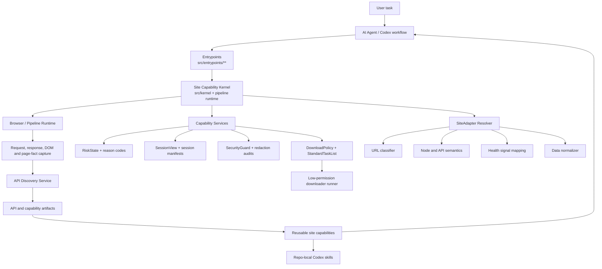

<h1 align="center">Browser-Wiki-Skill</h1>

<p align="center">
  A reusable Site Capability Layer for AI agents to understand, adapt to, and automate real websites.
</p>

<p align="center">
  
  
  
  
  
</p>

<p align="center">
  <a href="#why">Why</a> ·
  <a href="#core-idea">Core Idea</a> ·
  <a href="#features">Features</a> ·
  <a href="#architecture">Architecture</a> ·
  <a href="#quick-start">Quick Start</a> ·
  <a href="#roadmap">Roadmap</a>
</p>

Browser-Wiki-Skill is a reusable Site Capability Layer that helps AI agents understand, adapt to, and automate real websites through structured browser behavior, API discovery, and site-specific capability adapters.

It is not a one-off browser automation script collection. It is an architecture for turning real website behavior into governed, reusable capabilities: browser capture, API knowledge, session health, risk states, download policies, and repo-local Codex skills.

## Why

Most browser automation projects are fragile.

They are usually tightly coupled to one website's DOM structure, request pattern, login state, and anti-abuse behavior. Once the website changes, the automation breaks, and the reason is often hidden inside script failure logs.

Browser-Wiki-Skill solves this by introducing a reusable **Site Capability Layer**.

It separates:

- generic browser and pipeline orchestration
- reusable capability services
- site-specific adapters
- structured API knowledge
- session and risk state handling
- low-permission downloader execution
- governed artifact storage

So agents can work with websites in a more stable, explainable, and reusable way.

## Core Idea

Browser-Wiki-Skill treats each website as a set of discoverable and reusable capabilities.

Instead of hardcoding one-off browser scripts, it builds a layered system that can:

1. capture real browser behavior
2. discover useful network interfaces
3. normalize site-specific data
4. store reusable API and execution knowledge
5. preserve session and risk boundaries
6. expose stable capabilities to agents and skills

The goal is simple: a website should not be a pile of DOM selectors. It should become a documented capability surface that an AI agent can inspect, reason about, and reuse safely.

## Features

### Site Capability Layer

A layered architecture that separates site-agnostic orchestration from site-specific logic. The implementation is tracked in `CONTRIBUTING.md` as a 20-section Site Capability Layer matrix, currently marked `verified`.

### API Discovery

Captures observed browser network requests as candidates, records redacted evidence, and prevents automatic promotion into a verified API catalog. API promotion requires explicit evidence, adapter validation, schema compatibility, and policy gates.

Status: **Done for core infrastructure**, **Experimental for live site-specific evidence freshness**.

### Session View And Session Governance

Represents reusable login state through minimized session manifests and `SessionView` boundaries. Download and social consumers receive only governed session views, not raw cookies, browser profiles, or credential containers.

Status: **In progress**. Core contracts and tests exist; live recovery remains operator-approved and site-specific.

### Risk State And Health Recovery

Normalizes login walls, rate limits, CAPTCHA-like surfaces, profile health risks, platform risk, permission failures, and recovery paths into structured states and reason codes.

Status: **Done for core taxonomy and gates**, **Experimental for live account/session freshness**.

### SiteAdapter

Encapsulates website-specific behavior such as URL classification, node/API interpretation, pagination rules, login-state signals, health-signal mapping, field normalization, and capability mapping.

Status: **Done for registered adapters**, with continued site-specific hardening expected.

### Artifact System

Stores inventories, manifests, API candidates, catalog evidence, lifecycle events, download queues, redaction audits, and skill generation outputs as structured artifacts.

Status: **Done for governed artifact families**.

### Unified Download Runner

Moves downloads behind a low-permission runner with dry-run planning, manifests, queues, resume, retry, and native resource seed support. Legacy fallback remains behind explicit boundaries.

Status: **In progress**. Core runner is implemented; some live native resolver paths remain evidence-dependent.

## Use Cases

Browser-Wiki-Skill can be used for:

- building browser-based AI agents
- discovering website data APIs from real user flows
- converting website-specific behavior into reusable adapters
- reusing authenticated browser sessions without persisting raw secrets
- detecting login, permission, CAPTCHA, rate-limit, and profile-health states
- creating structured website capability knowledge
- reducing repeated work when supporting new websites
- producing repo-local Codex skills from governed site knowledge

For end users, this can eventually help agents:

- explain why a website task failed
- recover from login or session failures with human-visible boundaries
- avoid repeating the same verification steps
- reuse known workflows across similar websites
- make browser automation more stable and auditable

## Architecture



The kernel is intentionally light. It owns orchestration, lifecycle, context, artifact routing, schema governance, and safety boundaries. It does not own site-specific semantics.

Capability services are reusable. They provide discovery, inventory, API candidate handling, redaction, reason semantics, session views, risk state, policy handoff, lifecycle events, and schema compatibility.

SiteAdapters isolate each website. They own URL families, page/API interpretation, pagination, login and restriction signals, field normalization, and capability mapping.

The downloader is a low-permission consumer. It only receives governed tasks, policies, minimal session views, and resolved resources.

## Capability Matrix

| Capability | Common Service | SiteAdapter Required | Status |
| --- | ---: | ---: | --- |
| Request and page capture | Yes | Partial | Done |
| API candidate discovery | Yes | Partial | Done |
| Verified API catalog promotion | Yes | Yes | Experimental |
| Session reuse boundary | Yes | Site validation | In progress |
| Risk and health detection | Yes | Yes | Done |
| URL classification | No | Yes | Done |
| Request signing / site auth quirks | No | Yes | Planned |
| Pagination parsing | Partial | Yes | In progress |
| Data normalization | Partial | Yes | In progress |
| Artifact generation | Yes | No | Done |
| Redaction and secret scanning | Yes | No | Done |
| Unified download planning | Yes | Partial | In progress |
| Native resource resolution | Partial | Yes | Experimental |
| Repo-local skill generation | Yes | Yes | Done |

Status vocabulary:

- **Done**: implemented with focused tests and documented evidence.
- **In progress**: implemented for core paths, still expanding coverage or live evidence.
- **Experimental**: usable in constrained paths, but freshness and site-specific evidence matter.
- **Planned**: intentionally documented as a future or site-specific capability.

## Concepts

### Site Capability Layer

The architecture boundary that turns website behavior into reusable, governed capability surfaces.

### Site Capability Kernel

The site-agnostic orchestration layer. It coordinates lifecycle, context, schemas, artifacts, and safety boundaries without embedding concrete site rules.

### Capability Services

Shared services for discovery, inventory, API candidates, reason codes, redaction, risk state, session views, policy handoff, artifacts, and lifecycle hooks.

### SiteAdapter

A site-specific adapter for URL classification, semantic interpretation, health signals, pagination, field normalization, and capability mapping.

### SessionProvider / SessionView

This repo currently implements the boundary as session manifests, session runners, and `SessionView`. The public provider abstraction is still evolving, so session reuse is documented as **In progress** rather than a stable public API.

### RiskStateMachine

Implemented as `RiskState`, reason codes, health recovery, and execution gates. It classifies risks such as login walls, rate limits, CAPTCHA-like surfaces, account restrictions, and profile-health failures.

### Artifact System

Structured outputs for inventories, API candidates, catalogs, download manifests, queues, redaction audits, lifecycle events, reports, and skill generation.

### API Discovery

The capture-to-candidate flow that records observed network behavior as redacted evidence. Observed APIs are not automatically promoted to verified capability.

## Supported Sites

The current registry includes 21 site families. Support levels differ by site and capability; many catalog sites are read-only metadata integrations, not download targets.

| Site family | Discovery | Session | Risk detection | Adapter | Status |
| --- | ---: | ---: | ---: | ---: | --- |
| `www.22biqu.com` | Done | Not required | Partial | Done | Done |
| `www.qidian.com` | Done | Site-specific | Partial | Done | Done |
| `www.bz888888888.com` | Done | Not required | Done | Done | Experimental, Cloudflare challenge boundary |
| `www.bilibili.com` | Done | Site-specific | Done | Done | In progress |
| `www.douyin.com` | Done | Site-specific | Done | Done | In progress |
| `www.xiaohongshu.com` | Done | Site-specific | Done | Done | In progress |
| `x.com` | Done | Site-specific | Done | Done | Experimental |
| `www.instagram.com` | Done | Site-specific | Done | Done | Experimental |
| `jable.tv` | Done | Not required | Partial | Done | Done |
| `moodyz.com` | Done | Not required | Partial | Done | Done |
| Official AV catalog sites | Done | Not required | Partial | Done | Done for public metadata |

Official AV catalog sites include `rookie-av.jp`, `madonna-av.com`, `dahlia-av.jp`, `www.sod.co.jp`, `s1s1s1.com`, `attackers.net`, `www.t-powers.co.jp`, `www.8man.jp`, `www.dogma.co.jp`, `www.km-produce.com`, and `www.maxing.jp`.

## Quick Start

This repository currently has no `package.json`, so there is no `npm install` or `npm run dev` setup. The stable local workflow uses direct Node.js and Python entrypoints.

Clone the repository:

```bash
git clone https://github.com/yuetongli-PL/Browser-Wiki-Skill.git
cd Browser-Wiki-Skill
```

Initialize the local PowerShell environment:

```powershell
. .\scripts\bootstrap.ps1
```

Run a full pipeline against a site:

```powershell
node .\src\entrypoints\pipeline\run-pipeline.mjs https://www.22biqu.com/
```

Generate a repo-local skill:

```powershell
node .\src\entrypoints\pipeline\generate-skill.mjs https://www.22biqu.com/
node .\src\entrypoints\pipeline\generate-skill.mjs https://moodyz.com/works/date --skill-name moodyz-works
```

Run focused validation:

```powershell
node --test .\tests\node\site-capability-matrix.test.mjs
node --test .\tests\node\site-adapter-contract.test.mjs .\tests\node\site-onboarding-discovery.test.mjs
node --test .\tests\node\downloads-runner.test.mjs .\tests\node\planner-policy-handoff.test.mjs
node .\tools\prepublish-secret-scan.mjs
git diff --check
```

Run broad local validation before release-sized changes:

```powershell
node --test .\tests\node\*.test.mjs
python -m unittest discover -s .\tests\python -p "test_*.py"
```

## Basic Usage

> The public API is still experimental and may change as the Site Capability Layer evolves.

Use the CLI entrypoints directly.

Run site pipeline:

```powershell
node .\src\entrypoints\pipeline\run-pipeline.mjs https://www.22biqu.com/
```

Inspect site onboarding and health surfaces:

```powershell
node .\src\entrypoints\sites\site-doctor.mjs https://www.22biqu.com/
```

Plan downloads through the unified runner:

```powershell
node .\src\entrypoints\sites\download.mjs https://www.bilibili.com/video/BV... --dry-run
```

Aggregate public official AV release metadata:

```powershell
node .\src\entrypoints\sites\jp-av-release-catalog.mjs --start 2026-01-01 --end 2026-05-04
```

BZ888 public-direct script:

```powershell
python .\src\sites\bz888\download\python\bz888.py --book-url https://www.bz888888888.com/52/52885/ --out-dir .\book-content\bz888-direct
```

The BZ888 path reads only public HTML and stops with `blocked-by-cloudflare-challenge` when the site serves a challenge. It does not read cookies, browser profiles, or challenge-derived credentials.

## Design Principles

- **Capability-first, not script-first**<br>
  Websites are modeled as reusable capabilities, not one-off automation scripts.

- **Lightweight kernel, pluggable services**<br>
  The kernel handles orchestration, context, artifacts, schemas, lifecycle, and safety boundaries.

- **Site-specific logic stays isolated**<br>
  Each website keeps its own adapter for URL patterns, semantic interpretation, auth/risk signals, pagination, and normalization.

- **Learn from real browser behavior**<br>
  API knowledge should come from actual observed browser requests, then pass explicit validation before reuse.

- **Explainable automation**<br>
  Failures are represented as structured states and reason codes, not silent script errors.

- **Low-permission execution**<br>
  Downloaders and reports consume governed artifacts, not raw browser state.

## Roadmap

- [x] Define Site Capability Layer architecture
- [x] Add Site Capability Kernel contracts
- [x] Add request and response capture foundations
- [x] Add API candidate discovery and governed catalog artifacts
- [x] Add SiteAdapter contracts and registered adapters
- [x] Add SessionView and trust-boundary tests
- [x] Add RiskState, reason codes, and health recovery gates
- [x] Add artifact redaction and prepublish secret scan
- [x] Add unified download runner foundation
- [x] Add repo-local skill generation paths
- [ ] Stabilize a public JavaScript API surface
- [ ] Expand live API verification evidence per site
- [ ] Continue reducing legacy downloader fallback paths
- [ ] Improve human-visible recovery flow for login, session, and profile-health risks
- [ ] Add clearer release/versioning policy

## Repository Layout

| Path | Purpose |
| --- | --- |
| `src/entrypoints/` | CLI and workflow entrypoints. |
| `src/kernel/` | Site-agnostic kernel contracts and readiness checks. |
| `src/pipeline/` | Capture, expand, knowledge-base, and skill pipeline runtime. |
| `src/sites/capability/` | Shared Site Capability Layer services and governed contracts. |
| `src/sites/core/adapters/` | SiteAdapter implementations and resolver. |
| `src/sites/downloads/` | Unified download runner, policies, modules, resource seeds, and recovery. |
| `src/sites/sessions/` | Session manifests, repair commands, release gates, and runner contracts. |
| `config/` | Stable site registry and capability truth. |
| `profiles/` | Repo-safe site capability profiles, not browser profile directories. |
| `skills/` | Repo-local Codex Skill sources. |
| `crawler-scripts/` | Generated crawler scripts and metadata. |
| `tests/` | Node and Python contract, unit, boundary, and integration tests. |
| `tools/` | Release audit, secret scan, reports, and maintenance helpers. |

Long-lived project guidance lives in root files:

- `README.md` for project orientation.
- `CONTRIBUTING.md` for safety gates, Site Capability matrix, and verification batches.
- `AGENTS.md` for Codex execution rules.
- `SECURITY.md` for sensitive-data and automation boundaries.

## Contributing

Start with `CONTRIBUTING.md` and `AGENTS.md`.

Before staging changes:

```powershell
git status --short
node .\tools\prepublish-secret-scan.mjs
git diff --check
```

For Site Capability Layer work, update the implementation matrix in `CONTRIBUTING.md` and run the smallest focused test batch close to the changed behavior.

Do not commit:

- raw credentials, cookies, CSRF values, authorization headers, SESSDATA, tokens, or session ids
- browser profile directories
- `.playwright-mcp/`, `runs/`, `book-content/`, downloaded media, logs, or local runtime artifacts
- CAPTCHA, MFA, anti-bot, access-control, or platform-risk bypass logic

## Help And Maintenance

Use GitHub issues for project questions, bug reports, and capability requests. Security-sensitive reports should follow `SECURITY.md` and must not include raw secrets, cookies, profile paths, or screenshots containing credentials.

Current maintenance is repository-local and contributor-driven. The canonical source of truth for implementation status is the Site Capability Layer matrix in `CONTRIBUTING.md`.

## License

No `LICENSE` file is currently present in this repository. Until a license is added, do not assume MIT, Apache-2.0, or any other open-source license.

## Source Of Truth

- `CONTRIBUTING.md`: Site Capability Layer matrix, focused regression batches, safety gates, and release checks.
- `config/site-registry.json`: registered site families and implementation paths.
- `config/site-capabilities.json`: stable capability facts by host.
- `schema/profile-schemas.mjs`: checked-in profile validation rules.
- `tools/prepublish-secret-scan.mjs`: repository safety scan before publication.

This README is intentionally short enough to act as a GitHub project homepage. Detailed operational gates live in `CONTRIBUTING.md`.
