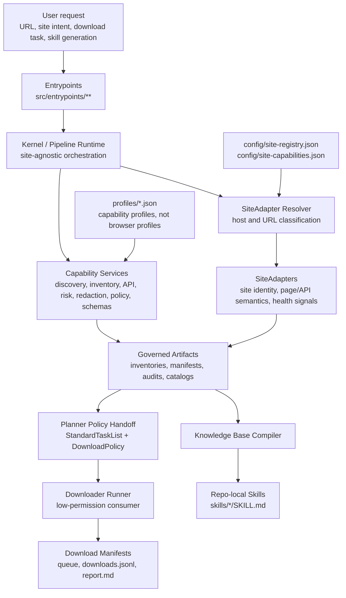
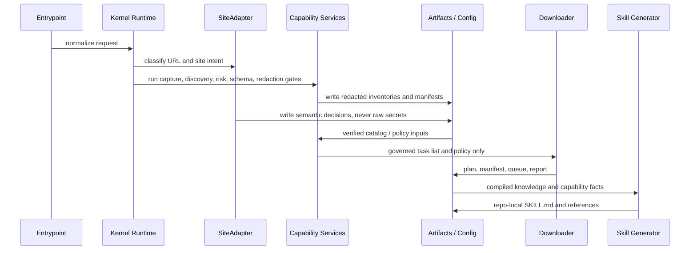
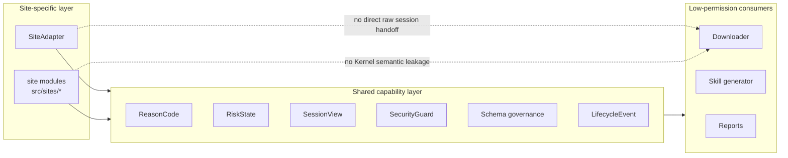
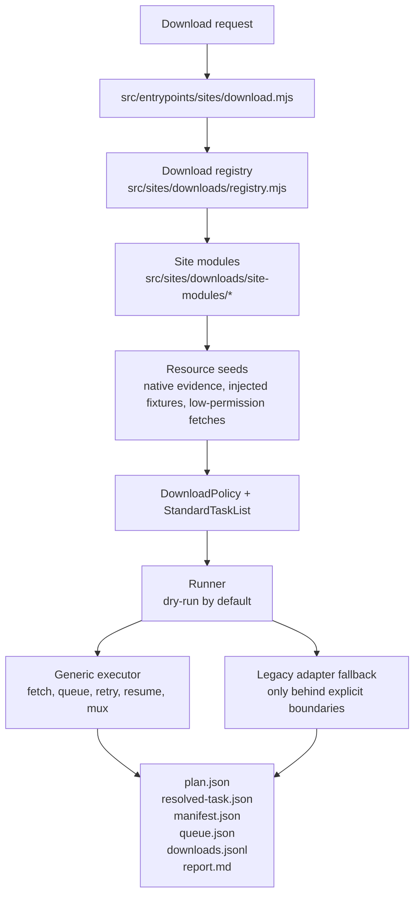

# Browser-Wiki-Skill

Browser-Wiki-Skill 是一个本地优先的多站点能力层工程。它不是把每个网站写成单独脚本，而是把站点识别、页面采集、能力建模、会话治理、下载边界、知识库编译和 Codex Skill 生成放进同一套可验证架构里。

当前重点是 Site Capability Layer：用统一的 Kernel、Capability Services、SiteAdapter 和 Downloader 边界，让新增站点可以按同一套契约接入，同时避免把站点语义、会话材料或高权限逻辑扩散到低权限执行路径。

## Architecture Overview



核心分层：

- `Kernel / Pipeline Runtime` 只负责协调、生命周期、上下文和通用安全语义，不写具体站点规则。
- `Capability Services` 提供跨站复用机制，包括 DOM/API discovery、inventory、risk、redaction、policy、schema、hook 和 artifact 写入保护。
- `SiteAdapter` 负责站点专属解释：URL 家族、页面类型、节点语义、API 语义、分页、登录/风险信号、字段标准化。
- `Downloader` 只消费经过治理的 `StandardTaskList`、`DownloadPolicy`、最小化 `SessionView` 和已解析资源，不接触原始 cookies、profile 或站点专属高权限逻辑。
- `Skills` 是产物，不是临时脚本；repo-local `skills/*` 是 Codex 可复用指令源。

## Data Flow



这条数据流的关键约束是“先治理，后执行”。观察到的 API、DOM 节点、登录状态或下载资源不会自动升级为可执行能力；它们必须经过 SiteAdapter 判断、schema 兼容、redaction、policy handoff 和测试证据。

## Boundary Model



安全边界：

- 不持久化 raw credentials、cookies、CSRF、Authorization、SESSDATA、tokens、session ids、browser profiles 或等价敏感材料。
- 不实现 CAPTCHA/MFA/anti-bot/access-control bypass，不做 credential extraction 或 silent privilege expansion。
- `profiles/*.json` 是站点能力配置，不是浏览器 profile 目录。
- `runs/`、`book-content/`、`.playwright-mcp/`、下载媒体、截图、运行日志属于本地 runtime artifacts，不应提交。
- 登录态能力使用 `SessionView`、manifest 和 health gate 表示；下载器不得读取原始会话容器。

## Site Onboarding Architecture

裸 URL 默认是完整站点接入，而不是只加一个 profile 或 skill。一个站点要被视为接入完成，需要覆盖：

- registry：`config/site-registry.json`
- capabilities：`config/site-capabilities.json`
- profile：`profiles/*.json`
- adapter：`src/sites/core/adapters/*`
- crawler/script metadata：`crawler-scripts/*`
- repo-local skill：`skills/<site>/SKILL.md`
- discovery artifacts：`NODE_INVENTORY`、`API_INVENTORY`、`UNKNOWN_NODE_REPORT`、`SITE_CAPABILITY_REPORT`、`DISCOVERY_AUDIT`
- tests：SiteAdapter contract、onboarding discovery、registry/profile/skill generation、站点专属 fixtures
- matrix：`CONTRIBUTING.md` 的 Site Capability Layer Implementation Matrix

如果登录墙、付费/VIP、CAPTCHA、risk-control、权限检查或 rate limit 阻断了 discovery，记录为 blocked surface；不要绕过。

## Download Architecture



下载器迁移目标是把下载行为放到统一 runner 后面。runner 默认 dry-run，支持 `--execute`、`--resume`、`--retry-failed`，并把状态写成稳定 manifest。站点模块可以解析资源，但下载执行层保持站点无关。

BZ888 有一个独立 public-direct 脚本：

```powershell
python .\src\sites\bz888\download\python\bz888.py --book-url https://www.bz888888888.com/52/52885/ --out-dir .\book-content\bz888-direct
```

它只读取公开 HTML，解码 GBK/GB18030，生成 TXT 和 manifest。遇到 Cloudflare challenge 时返回 `blocked-by-cloudflare-challenge`，不读取 cookies、不接收 cookie 参数、不复用浏览器 profile，也不把 challenge 视为可绕过目标。

## Repository Layout

| Path | Role |
| --- | --- |
| `src/entrypoints/` | CLI and workflow entrypoints. |
| `src/kernel/` | Site-agnostic orchestration and readiness contracts. |
| `src/pipeline/` | Capture, expand, KB, and skill pipeline runtime. |
| `src/sites/capability/` | Shared Site Capability Layer services and governed contracts. |
| `src/sites/core/adapters/` | SiteAdapter implementations and resolver. |
| `src/sites/downloads/` | Unified download runner, contracts, modules, resource seeds, recovery. |
| `src/sites/sessions/` | Session manifests, repair commands, release gates, runner contracts. |
| `config/` | Stable site registry and capability truth. |
| `profiles/` | Site capability profiles, redacted and repo-safe. |
| `skills/` | Repo-local Codex Skill sources. |
| `crawler-scripts/` | Generated crawler scripts and metadata. |
| `tests/` | Node/Python contract, unit, boundary, and integration tests. |
| `tools/` | Release audit, secret scan, reports, and local maintenance helpers. |

Long-lived documentation lives in root files only:

- `README.md` for architecture and operator orientation.
- `CONTRIBUTING.md` for safety gates, matrix, focused regression batches, and release checks.
- `AGENTS.md` for Codex execution rules.

The repository-level `docs/` directory is retired.

## Supported Site Families

The current registry covers 21 site families across public reading, video/catalog, social, Xiaohongshu, and official catalog workflows.

| Family | Examples | Architecture notes |
| --- | --- | --- |
| Public reading | `www.22biqu.com`, `www.qidian.com`, `www.bz888888888.com` | Chapter-content adapters, public navigation, governed download boundaries. |
| Video/catalog | `www.bilibili.com`, `www.douyin.com`, `www.xiaohongshu.com`, `jable.tv`, `moodyz.com` | SiteAdapter classification, page facts, native resource seeds where evidence is safe. |
| Social | `x.com`, `www.instagram.com` | Read-only social actions, session health gates, media/archive artifacts, no raw auth persistence. |
| Official AV catalog | `rookie-av.jp`, `madonna-av.com`, `dahlia-av.jp`, `www.sod.co.jp`, `s1s1s1.com`, `attackers.net`, `www.t-powers.co.jp`, `www.8man.jp`, `www.dogma.co.jp`, `www.km-produce.com`, `www.maxing.jp` | Public list/detail/profile metadata, release catalog aggregation, skipped/blocked coverage recorded explicitly. |

AV release aggregation entrypoint:

```powershell
node .\src\entrypoints\sites\jp-av-release-catalog.mjs --start 2026-01-01 --end 2026-05-04
```

## Quick Start

Initialize the local PowerShell environment:

```powershell
. .\scripts\bootstrap.ps1
```

Run the full pipeline for a site:

```powershell
node .\src\entrypoints\pipeline\run-pipeline.mjs https://www.22biqu.com/
```

Generate a repo-local skill:

```powershell
node .\src\entrypoints\pipeline\generate-skill.mjs https://www.22biqu.com/
node .\src\entrypoints\pipeline\generate-skill.mjs https://moodyz.com/works/date --skill-name moodyz-works
```

Run focused checks:

```powershell
node --test .\tests\node\site-capability-matrix.test.mjs
node --test .\tests\node\site-adapter-contract.test.mjs .\tests\node\site-onboarding-discovery.test.mjs
node --test .\tests\node\downloads-runner.test.mjs .\tests\node\planner-policy-handoff.test.mjs
node .\tools\prepublish-secret-scan.mjs
git diff --check
```

Run broad local validation when preparing a release-sized change:

```powershell
node --test .\tests\node\*.test.mjs
python -m unittest discover -s .\tests\python -p "test_*.py"
```

## Operational Governance

For Douyin and similar login-gated sites, the repo assumes no dedicated IP. Keep automation on the same trusted local network once a profile is healthy; do not rotate exits to evade risk. If captcha, verify page, rate limit, login wall, or platform-risk signals appear, quarantine the profile-network tuple and recover in a visible browser.

Authenticated workflows stay read-only unless an entrypoint explicitly documents otherwise. `site-login`, `site-keepalive`, `site-doctor`, social live verification, and download release gates must preserve the same boundary: no raw cookies in artifacts, no profile persistence in repo files, no bypass behavior.

## Source Of Truth

Use these files to understand current state:

- `CONTRIBUTING.md`: Site Capability Layer matrix, focused regression batches, safety gates, release checks.
- `config/site-registry.json`: registered site families and implementation paths.
- `config/site-capabilities.json`: stable capability facts by host.
- `schema/profile-schemas.mjs`: checked-in profile validation rules.
- `tools/prepublish-secret-scan.mjs`: repository safety scan before publication.

The Site Capability Layer is considered complete only when the matrix in `CONTRIBUTING.md` shows sections 1-20 as `verified` and review accepts the final state. Future work should keep the same architecture boundary: site-specific interpretation in SiteAdapters, reusable mechanisms in Capability Services, and low-permission execution in the downloader.
