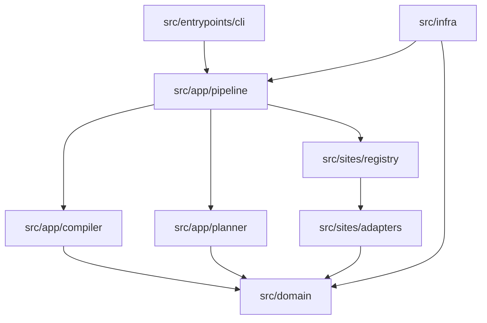

# SiteForge

SiteForge is a local, modular-monolith tool for turning a public site URL into a governed site capability workspace. The only public CLI surface is:

```bash
siteforge build https://example.com/
```

The build command crawls within bounded site rules, compiles evidence into capability contracts, plans descriptor-only actions, writes sanitized artifacts, and promotes verified site outputs under `.siteforge/sites/<site_id>/`.

For non-developers, SiteForge is a site capability translator. It records what a real site exposes, where risk or login boundaries appear, which actions are safe to plan, and how later AI workflows should explain blocked or partial outcomes.

## What SiteForge Solves

- Site structure changes should become explainable capability drift, not silent script failure.
- Login, permission, CAPTCHA, rate-limit, and platform-risk pages should be recorded as blocked states instead of bypassed.
- Site-specific interpretation should live in SiteAdapters, while Pipeline, Compiler, Planner, and Domain services stay site-agnostic.
- Raw cookies, tokens, browser profiles, session ids, and authorization headers must not become ordinary build artifacts.
- Generated site data belongs outside tracked source so the checkout stays a clean code repository.

## Outputs

| Output | Purpose |
| --- | --- |
| Site workspace | Sanitized evidence, diagnostics, and generated artifacts under `.siteforge/sites/<site_id>/`. |
| Capability contracts | Structured facts about pages, capabilities, risks, sessions, schemas, and policies. |
| Descriptor-only plans | Planner outputs that describe allowed, blocked, or remediation paths without executing privileged actions. |
| Repo-local Skill material | Generated guidance for later AI use, backed by capability evidence and safety boundaries. |

## Current Contract

- Deployment shape: one repository, one package, one CLI.
- Dependency rule: entrypoints -> app -> domain; infra and site adapters depend only on contracts they need.
- Business shape: Pipeline / Compiler / Planner.
- Public command: `siteforge build <url>`.
- Internal commands: Node entrypoints under `src/entrypoints/` are operator-only and are not public CLI routes.
- Runtime artifacts: generated site data belongs in `.siteforge/` or ignored transient directories, never in tracked source.

## Architecture



The durable map is [docs/architecture.md](docs/architecture.md).

## Repository Layout

| Path | Responsibility |
| --- | --- |
| `src/entrypoints/cli/` | Public CLI facade. |
| `src/entrypoints/pipeline/` | Internal stage entrypoints and runtime wiring. |
| `src/entrypoints/sites/` | Internal operator utilities for known sites and sessions. |
| `src/app/pipeline/` | End-to-end orchestration, build DAG, artifact lifecycle, recovery, output validation. |
| `src/app/compiler/` | Evidence, graph, and capability compilation into governed contracts. |
| `src/app/planner/` | Descriptor-only plans, blocked plans, remediation plans, and policy handoff. |
| `src/domain/` | Stable contracts for capabilities, policies, schemas, risks, sessions, artifacts, and lifecycle. |
| `src/sites/adapters/` | SiteAdapter contracts and site interpretation. |
| `src/sites/known-sites/` | Site-owned helpers for supported public sites. |
| `src/sites/registry/` | Site registry, profile, page type, and artifact lookup. |
| `src/infra/` | Browser, auth, config, filesystem, network, process, and CLI IO. |
| `src/skills/generation/` | Repo-local skill generation. |
| `config/` | Versioned stable site registry and capability records. |
| `schema/` | Published schema/profile definitions. |
| `tests/` | Node and Python tests, fixtures, and regression gates. |
| `tools/` | Release, cleanup, audit, and verification tooling. |

Retired Web UI, shared download runtime, legacy capability, legacy pipeline, and legacy kernel layers stay physically removed and are guarded by architecture tests.

## Supported Public Sites

Stable config currently keeps public records for:

- `www.22biqu.com`
- `www.qidian.com`
- `www.bz888888888.com`
- `moodyz.com`
- `jable.tv`
- `www.bilibili.com`
- `www.douyin.com`
- `www.xiaohongshu.com`
- `x.com`
- `www.instagram.com`

Removed internal catalog experiments are not part of the public site registry.

## Verification

Before release or merge, run:

```bash
npm run check:syntax
npm run test:node:focused
npm run test:node:all
npm run test:python
npm run scan:secrets
git diff --check
```

Focused tests are for batch work; the full gate above is required before publication.

Use `npm run clean:outputs` to remove local generated site data and keep the checkout source-only before staging.

## Safety

- Do not persist raw credentials, cookies, authorization headers, CSRF values, session ids, browser profiles, or tokens.
- Do not implement CAPTCHA bypass, anti-bot bypass, access-control bypass, credential extraction, or silent privilege expansion.
- Do not write generated site data into tracked source.
- Keep root-level `runs/`, `book-content/`, `knowledge-base/`, `profiles/`, `skills/`, `crawler-scripts/`, logs, downloads, caches, and browser state ignored and removable.
- Site-owned Python support files under `src/sites/known-sites/<site>/download/python/` are internal helpers, not a restored shared download runtime.

## Release And Versioning

- [x] Add clearer release/versioning policy

Release readiness is evidence-based, not date-based. No tag, package version bump, push, PR, publication, live capability claim, or live authenticated validation is implied by local tests passing.

Contract versions are governed by compatibility evidence in schema inventory and compatibility registry tests. Additive compatible fields keep the current schema or artifact version. Incompatible persisted or public contract changes require an explicit version bump and matching tests.

## Contributing

Use [CONTRIBUTING.md](CONTRIBUTING.md) for working rules, the Site Capability Layer matrix, focused regression batch definition, release boundaries, and operator runbooks. Use [AGENTS.md](AGENTS.md) for Codex-specific execution rules.

## Source Of Truth

- Architecture: [docs/architecture.md](docs/architecture.md)
- Release hardening: [docs/release-hardening-plan.md](docs/release-hardening-plan.md)
- Matrix and regression policy: [CONTRIBUTING.md](CONTRIBUTING.md)
- Active CLI: `package.json` bin -> `src/entrypoints/cli/index.mjs`
