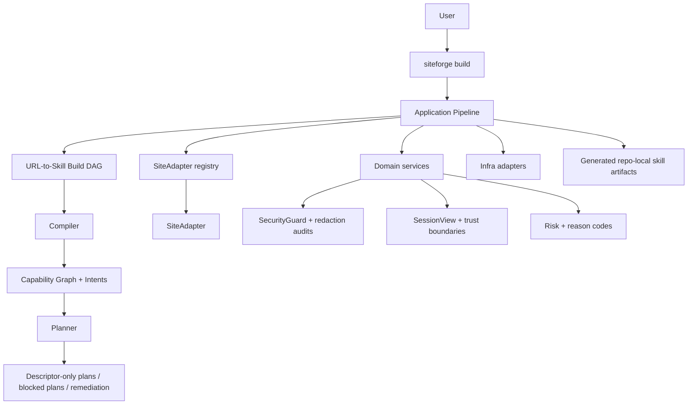

# SiteForge Architecture

Last reviewed: 2026-05-21.

SiteForge is a modular monolith: one repository, one package, one public CLI, and no remote service boundary. The architecture rule is clean-architecture dependency direction, while the business structure is Pipeline / Compiler / Planner.

## Public Surface

`siteforge build <url>` is the only public command. It enters through `src/entrypoints/cli/index.mjs`, dispatches to `src/entrypoints/pipeline/run-pipeline.mjs`, and runs the URL-to-Skill build DAG from `src/app/pipeline/build/`.

Internal entrypoints under `src/entrypoints/pipeline/` and `src/entrypoints/sites/` are operator/developer tools, not public subcommands.

## Template Directory Mapping

This checkout now uses the physical template tree. The dependency contract is enforced by tests and the top-level source directories mirror the target architecture.

| Clean layer | Current path | Responsibility |
| --- | --- | --- |
| Entrypoints | `src/entrypoints/` | CLI parsing, runtime assembly, progress/output mapping, and operator entrypoints. |
| Application Pipeline | `src/app/pipeline/` | Stage orchestration, build DAG state, artifact lifecycle, recovery flow, and build reporting. |
| Application Compiler | `src/app/compiler/` and `src/app/pipeline/stages/capability-compile.mjs` | Compile evidence, graphs, capability facts, intents, contracts, and safe artifacts. |
| Application Planner | `src/app/planner/` and `src/app/planner/policy-handoff.mjs` | Produce descriptor-only plans, blocked plans, and remediation plans from validated facts and policy. |
| Domain contracts/services | `src/domain/` plus root `schema/` and `config/` data | Site-agnostic contracts, reason codes, redaction, risk, policy, lifecycle, SessionView, schema, and compatibility. |
| Site adapters | `src/sites/adapters/` | Site identity, URL/page/API interpretation, health-signal mapping, normalization, and site-owned support code. |
| Site registry | `src/sites/registry/` | Stable site registry access, context, archetypes, page type inference, profile validation, and site-neutral lookup helpers. |
| Known sites | `src/sites/known-sites/` | Site-owned support code, query helpers, doctor scenarios, and approved site-specific implementation details. |
| Infrastructure | `src/infra/` | Browser, auth, CLI rendering, filesystem, process, and runtime IO adapters. |
| Skill generation | `src/skills/generation/` | Repo-local skill rendering, coverage gates, metadata sync, and publishing helpers. |
| Shared helpers | `src/shared/` | Site-neutral formatting, normalization, page-state helpers, and markdown utilities. |

Root-level site data folders are not part of the source tree. Local `book-content/`, `knowledge-base/`, `profiles/`, `skills/`, `crawler-scripts/`, `runs/`, and `.playwright-mcp/` directories are generated data or tool state and must stay deleted or ignored. Durable examples belong under `tests/fixtures/`; runtime output belongs under a local workspace such as `.siteforge/`.

## Dependency Rules

- Entrypoints may depend on application, domain contracts, site adapters through registries, and infra assembly code.
- Application Pipeline may depend on domain contracts and adapter registries, but not concrete site internals or retired runtimes.
- Compiler must stay descriptor/artifact oriented. It must not import entrypoints, browser runtime, or concrete filesystem writer implementations except through guarded artifact APIs.
- Planner must not import Pipeline runtime, SiteAdapter runtime, browser runtime, download runtime, or session orchestration.
- Domain contracts and capability services must not import entrypoints, concrete site implementations, scripts, or retired download runtime paths.
- Infrastructure must not depend on CLI entrypoints; live login/keepalive execution is injected by entrypoints or tests.
- SiteAdapter implementations own site-specific interpretation and must not push those semantics into Pipeline, Kernel, or downloader-like consumers.

## Retired Paths

These paths are intentionally absent and protected by tests:

- `src/sites/capability/build/web-interaction-*.mjs`
- `src/app/pipeline/build/web-interaction-*.mjs`
- `src/sites/downloads/`
- `src/entrypoints/sites/download.mjs`

Download-like behavior is not a top-level runtime layer. The remaining supported surface is descriptor-only planning and policy contracts such as StandardTaskList, DownloadPolicy, SessionView, and artifact guards. Site-owned Python support files under `src/sites/known-sites/<site>/download/python/` are not the retired shared download runtime and are not public commands.

## Runtime Flow

## Verification Gates

The architecture is protected by:

- `tests/node/architecture-import-rules.test.mjs`
- `tests/node/src-architecture-layout.test.mjs`
- `tests/node/site-capability-matrix.test.mjs`
- `tests/node/test-coverage-regression.test.mjs`
- `npm run test:node:all`
- `npm run test:python`
- `npm run scan:secrets`
- `git diff --check`
